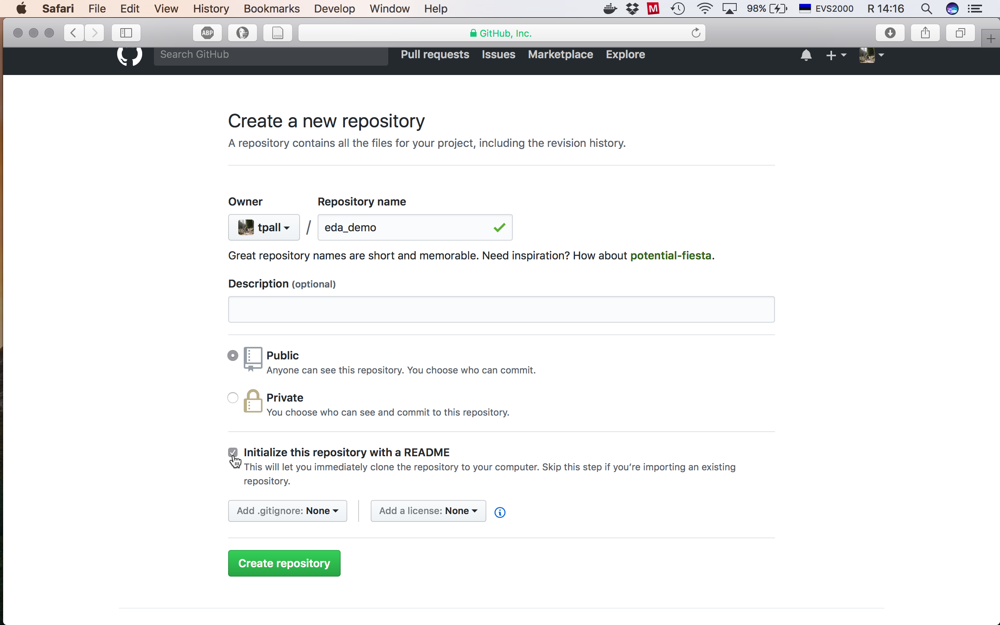
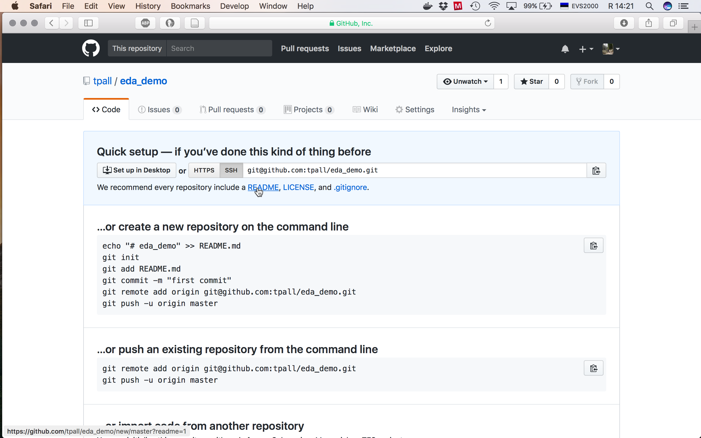
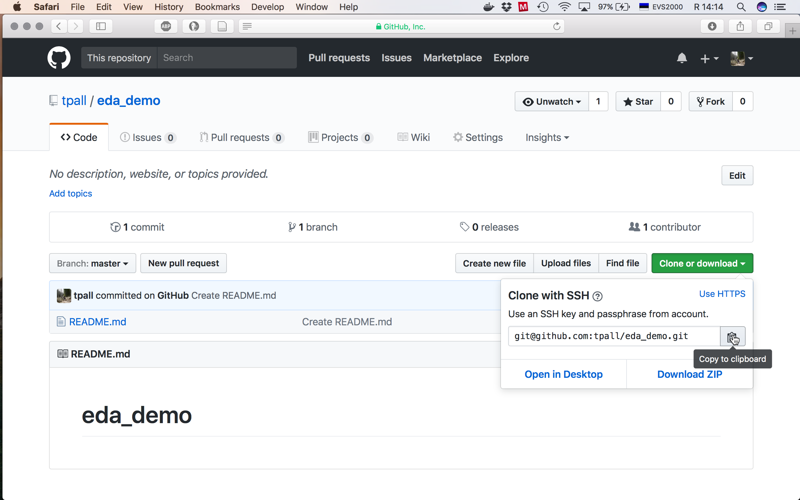
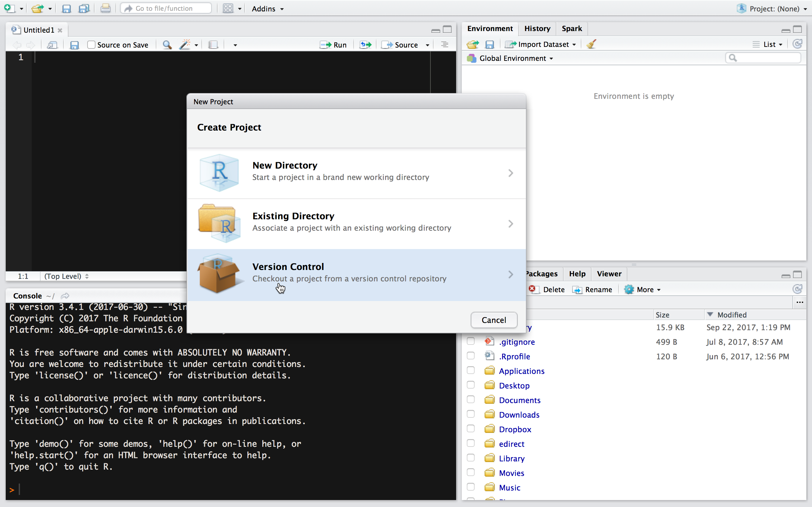
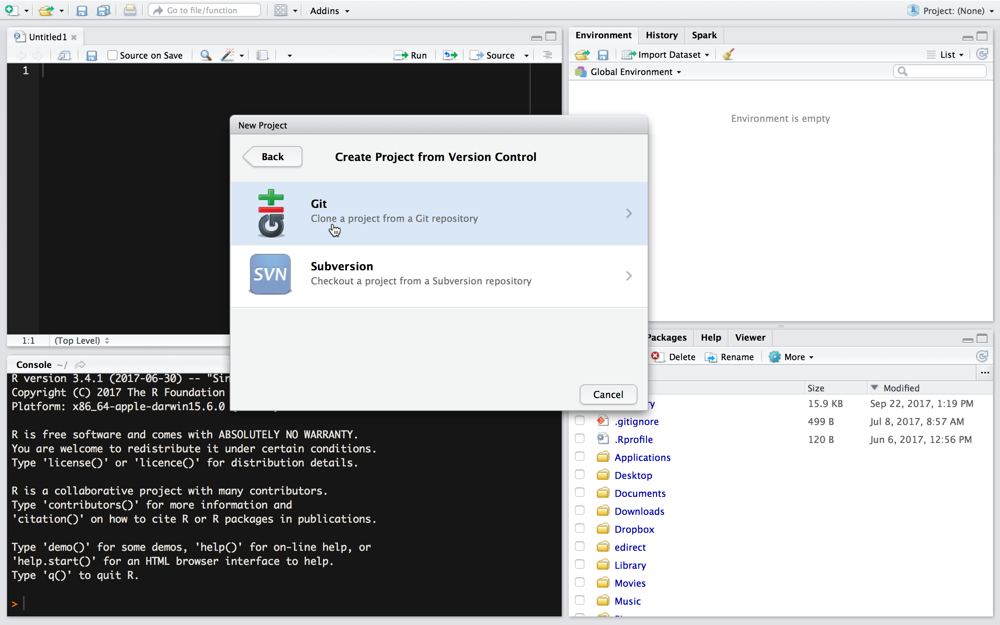
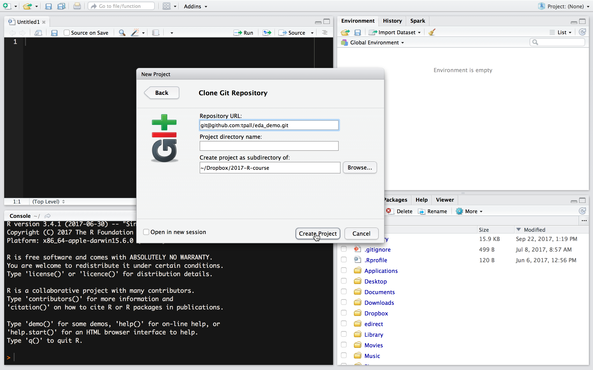
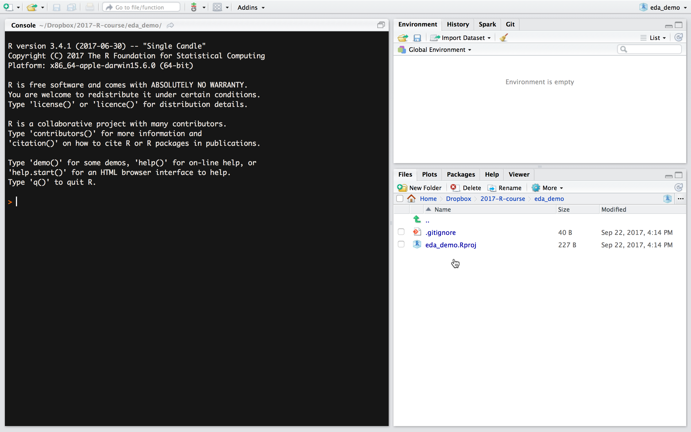

```{r setup, include=FALSE}
knitr::opts_chunk$set(echo = TRUE)
```

## Create GitHub repo

Here we create a new GitHub repo on GitHub named `eda_demo` and use this repo to start new RStudio project in your local computer.

1. step -- go to your [GitHub](https://github.com) account and create new repo: "+" > "New repository" > "Repository name": `eda_demo` > "Create repository" (Check: "Initialize this repository with a README").

```{r, echo=FALSE, fig.cap="Step 1. Initialise repo with README.", out.width=600}

```


```{r,echo=FALSE, fig.cap="Alternative step 1. If you forgot to create README.md in previous step you can add README in quick setup by clicking README. Then you need to scroll to the bottom of the page and commit your just created README. You can also skip creating README this time and clone repo by copying link shown in quick setup to clipboard and then proceed directly to the 3. step.", out.width=600}

```

2. step -- clone repo by clicking on "Clone or download" button > "Copy to clipboard".

```{r,echo=FALSE, fig.cap="Step 2. Clone your repo.", out.width=600}

```

## Create RStudio project

3. step -- go to RStudio > "Project: (None)" > "New Project" > "Version Control".

```{r, echo=FALSE, fig.cap="Step 3. Create RStudio project from version control.", out.width=600}

```

4. step -- "Create Project from Version Control" > "Git" > Paste GitHub link into "Repository URL" field > "Create Project".

```{r,echo=FALSE, fig.cap="Step 4. Create a project from a Git repository.", out.width=600}

```


```{r, echo=FALSE, fig.cap="Step 4. Clone Git repository and create project.", out.width=600}

```

5. step -- congratulations! you have an empty RStudio project that you can start to fill with content. Don't forget to push your changes to GitHub. 

```{r, echo=FALSE, fig.cap="Step 5. Empty project. Note missing README. ", out.width=600}

```

